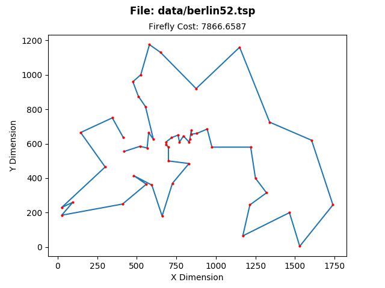

# <b> Firefly Algorithm Tsp </b>
[](https://julialang.org/downloads/)
[](LICENSE.md)


## <b> Travelling Salesman Problem (TSP) </b>

The travelling salesman problem (TSP) asks the following question: "Given a list of cities and the distances between each pair of cities, what is the shortest possible route that visits each city and returns to the origin city?"

<p align="center">

</p>

## <b> Overview </b>

This repository tries to solve well known TSP problems from TSPLIB with firefly algorithm. TSPLIB is a library of sample instances for the TSP (and related problems) from various sources and of various types. For more information please check out the following: <a href="https://wwwproxy.iwr.uni-heidelberg.de/groups/comopt/software/TSPLIB95/">TSPLIB</a>

This repository handles, the symmetric travelling salesman problems. In the symmetric TSP, the distance between two cities is the same in each opposite direction, forming an undirected graph. This symmetry halves the number of possible solutions.

By downloading this repository you will have some example TSPLIB files in "data" folder downloaded from link above. You can use different data files to run this code; However, this data file must be in the same format with the examples in data file according to not have read file errors.

After running the project successfully you will have "graphs" and "logs" from the current run under the associated files. These files have names with timestamps and data file name included. So you can run over and over again without overriding you logs and graphics.

In the "graps" folder you will have two different graphics from one successfully run. One will show the best firefly's path painted included with value. The second one shows the best path costs for the each iteration.

In the "logs" section you will have one log file named timestamped and file name included. This file will have some insights about your run. Such as time, hyperparameters, path costs.

You can tune the hyperparameters of the algorithm by modifying the hyperparameter section in `main.jl` file.

## <b>Requirements</b>

- Docker and docker-compose is enough to run this project. But if you dont have docker you can run `main.jl` file in the "src" folder manually as well. For manual running check the following part to handle requirements.

### Manual Running

- On Linux (Debian Based Systems)

    You need to have Julia-1.1 to run this project without any errors. Check this link to install Julia. <a href="https://julialang.org/downloads/"> Install Julia </a>  

    ```console
   $ sudo apt-get update && apt-get install \
                                wget \
                                ca-certificates \
                                python3 \
                                python3-dev \
                                python3-pip \
                                python3-matplotlib
    ```
    You can check how to install the same dependencies in other distros.

## <b>How to Run ?</b>

- #### With Docker Compose

    ```console
    $ git clone https://github.com/zahidkizmaz/firefly-algorithm-tsp
    $ cd firefly-algorithm-tsp
    $ chmod +x start.sh
    $ ./start.sh data/st70.tsp
    ```

- #### Without Docker Compose

    Julia 1.1 must be installed to your system.     Before you run the `main.jl` you need to    define a environment variable named    `TSP_FILE`.

    ```console
    $ git clone https://github.com/zahidkizmaz/ firefly-algorithm-tsp
    $ cd firefly-algorithm-tsp
    $ TSP_FILE=data/st70.tsp
    $ julia src/main.jl
    ```

## <b>References</b>

[1] Yongquan Zhou, Zhengxin Huang. Artificial glowworm swarm optimization for TSP[J].Control and Decision.2012,27(12):1816-1821.

[2] WANG Ming-bo,FU Qiang,TONG Nan,LI Mengmeng,ZHAO Yiming. An improved firefly algorithm for traveling salesman problems

[3] https://en.wikipedia.org/wiki/Travelling_salesman_problem